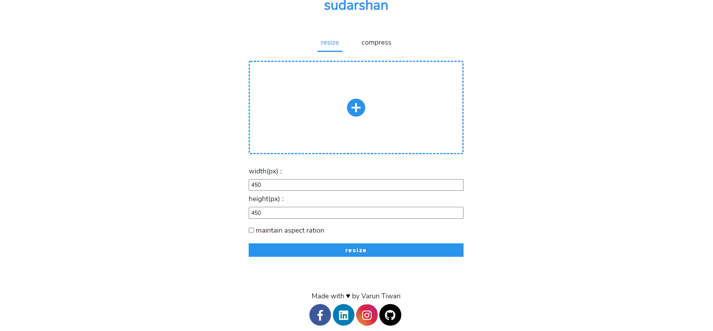
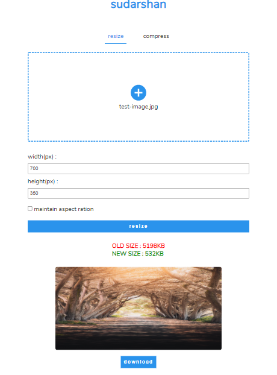
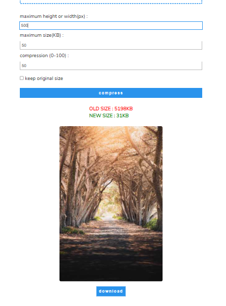

<p align='center'>

</p>
<p align='center'>
<b>Image resizing and compressing application</b>
</p>
<p align='center'>
<a href='https://sudarshan.netlify.app/' target='_blank'>sudarshan.netlify.app</a>
</p>

---

<p align='center'>
This is image compressor and resizer build using <a href='https://developer.mozilla.org/en-US/docs/Web/JavaScript' target='_blank'>javascript</a> and hosted with <a href='https://app.netlify.com/' target='_blank'>netlify</a>
</p>
<p align='center'>




</p>

#### 🧾 Description

Sudarshan an online tool allows users to alter the size of images as per their needs. The app also features an image compressor that reduces the image's size according to user preferences.

#### 🛠 Installation and setup

1. Clone the repo to your local machine.
2. Run the app using npm command :
   ```javascript
   npx serve
   ```

<br>
<br>
<br>

<p align='center'>
(If you liked the project, give it star 😃)
</p>
